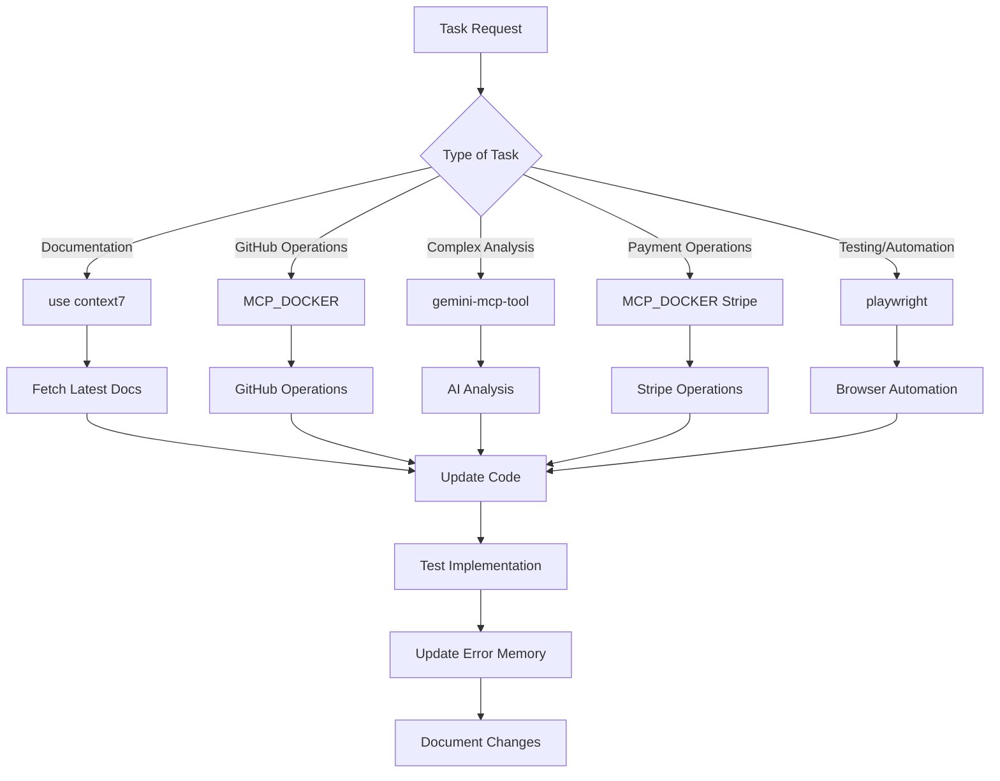

# MCP Integration Rules - Yoobe Platform

## OBRIGATÓRIO: Regras de Uso de MCPs

### 🎯 REGRA 1: Context 7 para Documentação

**SEMPRE** usar `use context7` quando:

- Buscar documentação de bibliotecas
- Precisar de exemplos de código atualizados
- Verificar APIs ou funcionalidades novas
- Resolver problemas de compatibilidade

```bash
# ✅ CORRETO
How do I implement React Query v5 mutations? use context7

# ❌ INCORRETO
How do I implement React Query mutations?
```

### 🎯 REGRA 2: MCP_DOCKER para GitHub

**SEMPRE** usar MCP_DOCKER quando:

- Criar/modificar issues ou PRs
- Gerenciar releases e tags
- Monitorar workflows
- Operações de repositório

### 🎯 REGRA 3: MCP_DOCKER para Stripe

**SEMPRE** usar MCP_DOCKER quando:

- Processar pagamentos
- Gerenciar clientes
- Criar produtos/preços
- Processar reembolsos

### 🎯 REGRA 4: gemini-mcp-tool para Análises

**SEMPRE** usar gemini-mcp-tool quando:

- Análise de código complexo
- Geração de documentação técnica
- Tradução de conteúdo
- Resumos de arquivos grandes

### 🎯 REGRA 5: playwright para Testes e Automação

**SEMPRE** usar playwright quando:

- Testes end-to-end automatizados
- Captura de screenshots para documentação
- Web scraping de dados externos
- Validação de funcionalidades web
- Testes de interface de usuário

## 🚨 VIOLAÇÕES CRÍTICAS

### ❌ NUNCA Fazer:

1. **Operações GitHub Manuais**: Usar MCP_DOCKER sempre
2. **Documentação Desatualizada**: Usar Context 7 sempre
3. **Análises Sem AI**: Usar gemini-mcp-tool para análises complexas
4. **Pular Error Memory**: Sempre atualizar `data/error-memory.json`

### ✅ SEMPRE Fazer:

1. **Use Context 7 First**: Buscar documentação atualizada
2. **Automate Operations**: Usar MCPs para todas operações
3. **Update Error Memory**: Registrar erros e soluções
4. **Follow Workflow**: Seguir fluxo MCP estabelecido

## 📊 Métricas Obrigatórias

- ✅ Uso de Context 7 em 100% das buscas de documentação
- ✅ Uso de MCP_DOCKER em 100% das operações GitHub/Stripe
- ✅ Uso de gemini-mcp-tool em análises complexas
- ✅ Atualização de error memory em 100% dos bugs

## 🔄 Fluxo de Trabalho MCP



## 📚 Documentação

- **Guia Completo**: `docs/MCP_INTEGRATION_GUIDE.md`
- **Error Memory**: `data/error-memory.json`
- **Configuração**: `~/.cursor/mcp.json`

---

**IMPORTANTE**: Estas regras são OBRIGATÓRIAS e devem ser seguidas em 100% dos casos. Violações resultam em inconsistências e perda de eficiência.
