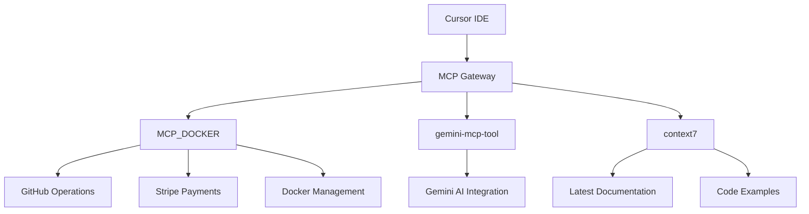
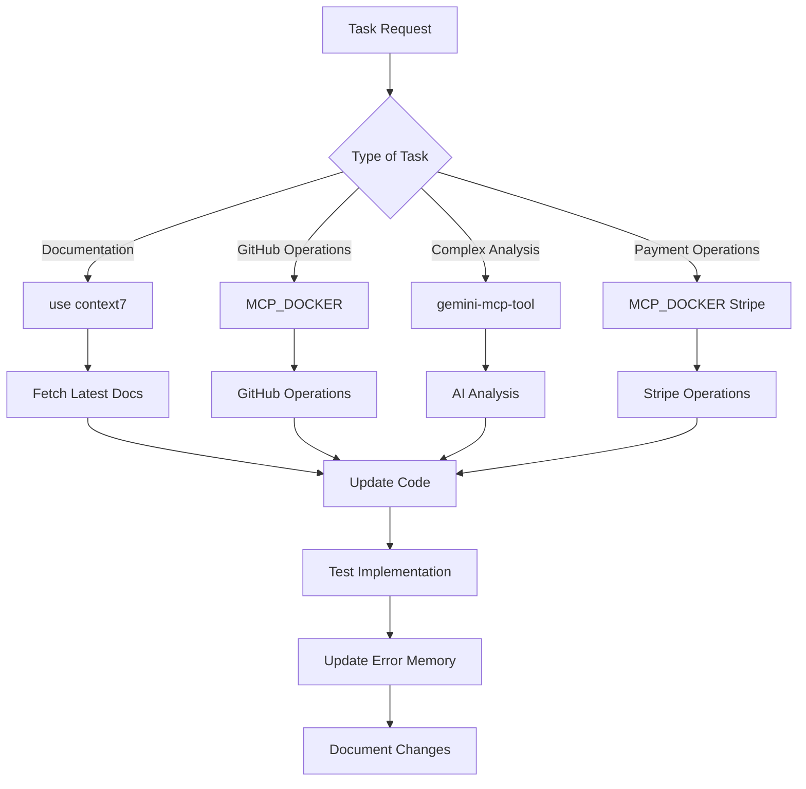

# 🔧 MCP Integration Guide - Yoobe Platform

## 📋 Índice

- [Visão Geral](#visão-geral)
- [MCPs Configurados](#mcps-configurados)
- [Regras de Uso](#regras-de-uso)
- [Casos de Uso](#casos-de-uso)
- [Best Practices](#best-practices)
- [Troubleshooting](#troubleshooting)

---

## 🎯 Visão Geral

Este documento estabelece as regras e diretrizes para uso eficiente dos Model Context Protocol (MCP) servers na plataforma Yoobe. Os MCPs são ferramentas essenciais que automatizam operações complexas e integram serviços externos.

### 🏗️ Arquitetura MCP



---

## 🔧 MCPs Configurados

### 1. **MCP_DOCKER** 🐳

**Package**: `docker mcp gateway run`
**Purpose**: Operações GitHub, Stripe, Docker e gerenciamento de containers

#### 🛠️ Ferramentas Disponíveis:

- **GitHub**: Issues, PRs, commits, releases, workflows
- **Stripe**: Payments, customers, subscriptions, invoices
- **Docker**: Container management, image operations
- **General**: File operations, notifications, security

#### 📋 Casos de Uso:

- ✅ Criação de issues e PRs
- ✅ Gerenciamento de releases
- ✅ Processamento de pagamentos
- ✅ Deploy de containers
- ✅ Monitoramento de workflows

### 2. **gemini-mcp-tool** 🤖

**Package**: `npx -y gemini-mcp-tool`
**Purpose**: Integração com Gemini AI para análises avançadas

#### 🛠️ Ferramentas Disponíveis:

- **AI Analysis**: Code analysis, documentation generation
- **Content Creation**: Automated content generation
- **Translation**: Multi-language support
- **Summarization**: Document and code summarization

#### 📋 Casos de Uso:

- ✅ Análise de código complexo
- ✅ Geração de documentação
- ✅ Tradução de conteúdo
- ✅ Resumos automáticos

### 3. **context7** 📚

**Package**: `npx -y @upstash/context7-mcp`
**Purpose**: Acesso à documentação mais recente e exemplos de código

#### 🛠️ Ferramentas Disponíveis:

- **Documentation Fetching**: Latest library docs
- **Code Examples**: Version-specific examples
- **API References**: Current API documentation
- **Best Practices**: Up-to-date best practices

#### 📋 Casos de Uso:

- ✅ Busca de documentação atualizada
- ✅ Exemplos de código específicos
- ✅ Referências de API
- ✅ Melhores práticas

### 4. **playwright** 🎭

**Package**: `npx -y @executeautomation/playwright-mcp-server`
**Purpose**: Automação de browser e testes end-to-end

#### 🛠️ Ferramentas Disponíveis:

- **Browser Automation**: Navegação e interação com páginas web
- **Screenshot Capture**: Captura de screenshots para documentação
- **JavaScript Execution**: Execução de código JavaScript no browser
- **Web Scraping**: Extração de dados de páginas web
- **Form Filling**: Preenchimento automático de formulários
- **Element Interaction**: Cliques, digitação, seleção de elementos

#### 📋 Casos de Uso:

- ✅ Testes end-to-end automatizados
- ✅ Captura de screenshots para documentação
- ✅ Web scraping de dados externos
- ✅ Testes de interface de usuário
- ✅ Validação de funcionalidades web
- ✅ Automação de workflows de teste

---

## 📏 Regras de Uso

### 🎯 **Regra 1: Uso Automático de Context 7**

**SEMPRE** use `use context7` quando:

- Buscar documentação de bibliotecas
- Precisar de exemplos de código atualizados
- Verificar APIs ou funcionalidades novas
- Resolver problemas de compatibilidade

```bash
# ✅ CORRETO
How do I implement React Query v5 mutations? use context7

# ❌ INCORRETO
How do I implement React Query mutations?
```

### 🎯 **Regra 2: MCP_DOCKER para Operações GitHub**

**SEMPRE** use MCP_DOCKER quando:

- Criar/modificar issues ou PRs
- Gerenciar releases e tags
- Monitorar workflows
- Operações de repositório

```bash
# ✅ CORRETO - Usar MCP_DOCKER automaticamente
Create a new issue for the cart functionality bug

# ❌ INCORRETO - Não especificar MCP
Create a new issue for the cart functionality bug
```

### 🎯 **Regra 3: MCP_DOCKER para Operações Stripe**

**SEMPRE** use MCP_DOCKER quando:

- Processar pagamentos
- Gerenciar clientes
- Criar produtos/preços
- Processar reembolsos

```bash
# ✅ CORRETO - Usar MCP_DOCKER automaticamente
Create a new Stripe product for the premium plan

# ❌ INCORRETO - Não usar MCP
Create a new Stripe product for the premium plan
```

### 🎯 **Regra 4: gemini-mcp-tool para Análises Complexas**

**SEMPRE** use gemini-mcp-tool quando:

- Análise de código complexo
- Geração de documentação técnica
- Tradução de conteúdo
- Resumos de arquivos grandes

```bash
# ✅ CORRETO - Usar gemini-mcp-tool automaticamente
Analyze the checkout system architecture and generate documentation

# ❌ INCORRETO - Não usar MCP
Analyze the checkout system architecture
```

### 🎯 **Regra 5: playwright para Testes e Automação**

**SEMPRE** use playwright quando:

- Testes end-to-end automatizados
- Captura de screenshots para documentação
- Web scraping de dados externos
- Validação de funcionalidades web
- Testes de interface de usuário

```bash
# ✅ CORRETO - Usar playwright automaticamente
Take a screenshot of the checkout page and test the payment flow

# ❌ INCORRETO - Não usar MCP
Take a screenshot of the checkout page
```

---

## 🎪 Casos de Uso por Contexto

### 🏪 **Desenvolvimento de Features**

#### **Criação de Nova Feature**

1. **Context 7**: Buscar documentação atualizada

   ```
   How to implement cart functionality in Next.js 14? use context7
   ```

2. **MCP_DOCKER**: Criar issue no GitHub

   ```
   Create issue: "Implement cart functionality with add/remove items"
   ```

3. **MCP_DOCKER**: Criar branch e PR
   ```
   Create branch "feature/cart-functionality" and PR
   ```

#### **Integração de Pagamentos**

1. **Context 7**: Documentação Stripe

   ```
   How to implement Stripe payments in Next.js? use context7
   ```

2. **MCP_DOCKER**: Configurar produtos Stripe

   ```
   Create Stripe product for premium subscription
   ```

3. **MCP_DOCKER**: Testar webhooks
   ```
   Create test payment and verify webhook
   ```

### 🐛 **Debugging e Correções**

#### **Análise de Erros**

1. **gemini-mcp-tool**: Análise de código

   ```
   Analyze this error and suggest solutions
   ```

2. **Context 7**: Documentação de debugging

   ```
   How to debug Next.js API routes? use context7
   ```

3. **MCP_DOCKER**: Criar issue de bug
   ```
   Create bug report for authentication redirect issue
   ```

### 📚 **Documentação e Manutenção**

#### **Atualização de Documentação**

1. **Context 7**: Documentação atualizada

   ```
   Get latest Next.js 14 documentation for app router? use context7
   ```

2. **gemini-mcp-tool**: Geração de conteúdo

   ```
   Generate comprehensive API documentation
   ```

3. **MCP_DOCKER**: Commit e release
   ```
   Commit documentation updates and create release
   ```

---

## 🏆 Best Practices

### ✅ **SEMPRE Fazer**

1. **Use Context 7 First**: Sempre buscar documentação atualizada
2. **Automate GitHub Operations**: Usar MCP_DOCKER para todas operações GitHub
3. **Leverage AI Analysis**: Usar gemini-mcp-tool para análises complexas
4. **Update Error Memory**: Registrar erros e soluções no `data/error-memory.json`
5. **Document Everything**: Manter documentação atualizada

### ❌ **NUNCA Fazer**

1. **Manual GitHub Operations**: Não fazer operações GitHub manualmente
2. **Outdated Documentation**: Não usar documentação desatualizada
3. **Skip Error Logging**: Não registrar erros e soluções
4. **Ignore MCP Tools**: Não usar MCPs quando disponíveis
5. **Inconsistent Practices**: Não seguir padrões estabelecidos

### 🔄 **Fluxo de Trabalho Recomendado**



---

## 🚨 Troubleshooting

### **Problema**: MCP não responde

**Solução**:

1. Verificar se Cursor foi reiniciado
2. Verificar configuração em `~/.cursor/mcp.json`
3. Verificar logs do MCP server

### **Problema**: Context 7 não encontra documentação

**Solução**:

1. Usar `use context7` no prompt
2. Especificar versão da biblioteca
3. Usar termos específicos

### **Problema**: MCP_DOCKER não conecta

**Solução**:

1. Verificar se Docker está rodando
2. Verificar permissões de GitHub/Stripe
3. Verificar configuração de API keys

---

## 📊 Métricas de Uso

### **KPIs Recomendados**

- ✅ Uso de Context 7 em 100% das buscas de documentação
- ✅ Uso de MCP_DOCKER em 100% das operações GitHub/Stripe
- ✅ Uso de gemini-mcp-tool em análises complexas
- ✅ Atualização de error memory em 100% dos bugs
- ✅ Documentação atualizada em 100% das features

### **Monitoramento**

- Logs de uso de MCPs
- Tempo de resposta das operações
- Taxa de sucesso das integrações
- Qualidade da documentação gerada

---

## 🔄 Atualizações

**Última Atualização**: 2025-09-08
**Versão**: 1.0.0
**Próxima Revisão**: 2025-02-27

### **Changelog**

- v1.0.0: Criação inicial do guia MCP
- Configuração de 3 MCPs principais
- Estabelecimento de regras de uso
- Definição de best practices

---

**Nota**: Este documento deve ser atualizado sempre que novos MCPs forem adicionados ou regras forem modificadas.
