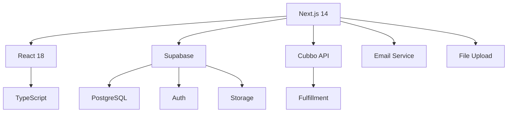
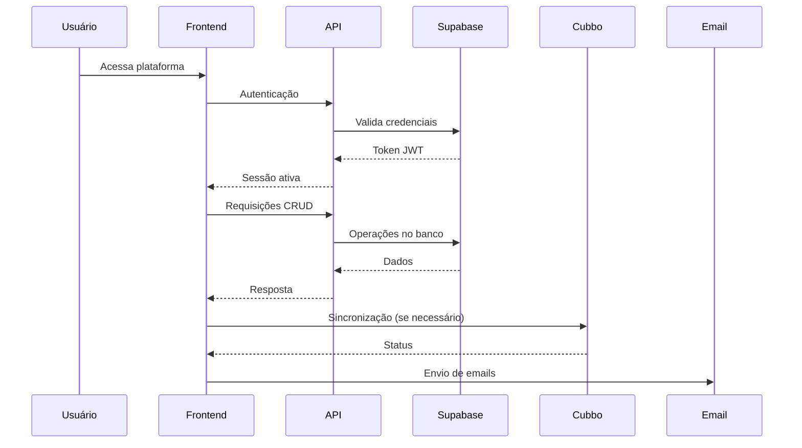
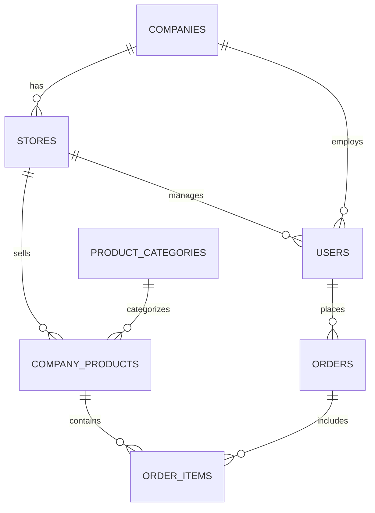

# 🚀 Yoobe Platform - Visão Geral Completa

## 📋 Índice
- [Visão Geral](#visão-geral)
- [Arquitetura](#arquitetura)
- [Funcionalidades](#funcionalidades)
- [Integrações](#integrações)
- [APIs](#apis)
- [Banco de Dados](#banco-de-dados)
- [Deploy](#deploy)
- [Troubleshooting](#troubleshooting)

---

## 🎯 Visão Geral

A **Yoobe Platform** é uma solução completa para gestão de brindes corporativos, gamificação e fulfillment. Nossa plataforma permite que empresas criem suas próprias lojas de brindes, integrem sistemas de gamificação e gerenciem todo o processo de fulfillment através da integração com Cubbo.

### 🏗️ Stack Tecnológica



### 📊 Características Principais

| Característica | Descrição | Status |
|----------------|-----------|--------|
| **Multi-tenant** | Cada empresa tem sua própria loja | ✅ Ativo |
| **Gamificação** | Integração com Workvivo, Applause, Human | ✅ Ativo |
| **Fulfillment** | Integração completa com Cubbo | ✅ Ativo |
| **Automação** | Zapier, Floui, Make | ✅ Ativo |
| **ERP/CRM** | SAP, Salesforce, Oracle | 🔄 Em desenvolvimento |

---

## 🏛️ Arquitetura

### Estrutura de Pastas

```
yoobe-v3/
├── app/                    # Next.js App Router
│   ├── admin/             # Painel administrativo global
│   ├── gestor/            # Painel do gestor da loja
│   ├── store/             # Loja pública
│   └── api/               # APIs REST
├── components/            # Componentes React
│   ├── ui/               # Componentes base
│   └── layout/           # Layouts
├── lib/                  # Utilitários e configurações
├── docs/                 # Documentação
└── supabase/            # Migrações e configurações
```

### Fluxo de Dados



---

## ⚡ Funcionalidades

### 👥 Perfis de Usuário

#### **Admin Global**
- Gerenciamento de todas as empresas
- Configuração de integrações globais
- Monitoramento do sistema
- Gestão de usuários globais

#### **Gestor da Loja**
- Gerenciamento da própria loja
- Configuração de produtos
- Gestão de funcionários
- Relatórios de vendas

#### **Funcionário**
- Acesso à loja da empresa
- Compra de produtos
- Visualização de pontos
- Histórico de pedidos

### 🏪 Sistema de Lojas

Cada empresa pode ter uma ou mais lojas com:

- **Domínio personalizado**: `loja.empresa.yoobe.com`
- **Design customizável**: Cores, logo, layout
- **Catálogo de produtos**: Produtos específicos da empresa
- **Sistema de pontos**: Integração com gamificação
- **Checkout integrado**: Processamento de pedidos

### 🎮 Gamificação

Integração com plataformas populares:

| Plataforma | Funcionalidade | Status |
|------------|----------------|--------|
| **Workvivo** | Pontos e recompensas | ✅ Ativo |
| **Applause** | Gamificação de feedback | ✅ Ativo |
| **Human** | Engajamento de equipes | ✅ Ativo |

---

## 🔗 Integrações

### 🚚 Cubbo (Fulfillment)

A integração com Cubbo é o coração do sistema de fulfillment:

```typescript
// Exemplo de configuração
const cubboConfig = {
  apiKey: process.env.CUBBO_API_KEY,
  baseUrl: 'https://api.cubbo.com/v1',
  isGlobal: true, // Integração global para todas as lojas
  features: {
    products: true,
    inventory: true,
    orders: true,
    tracking: true
  }
}
```

#### Funcionalidades Cubbo

- ✅ **Sincronização de Produtos**: Produtos criados na Yoobe são automaticamente sincronizados
- ✅ **Gestão de Estoque**: Controle centralizado do estoque
- ✅ **Processamento de Pedidos**: Pedidos são enviados automaticamente para fulfillment
- ✅ **Rastreamento**: Status de entrega em tempo real
- ✅ **Logs Detalhados**: Registro completo de todas as operações

### 🤖 Automação (Zapier, Floui, Make)

Permite integração com:

- **ERP/CRM**: SAP, Salesforce, Oracle
- **Gestão de Usuários**: AD, Google Workspace, M365
- **Marketing**: HubSpot, Mailchimp
- **Analytics**: Google Analytics, Mixpanel

---

## 🔌 APIs

### Autenticação

Todas as APIs requerem autenticação via JWT:

```bash
curl -X GET https://api.yoobe.com/v1/users \
  -H "Authorization: Bearer YOUR_JWT_TOKEN"
```

### Endpoints Principais

#### Usuários
```typescript
// Listar usuários
GET /api/users

// Criar usuário
POST /api/users
{
  "email": "user@company.com",
  "full_name": "Nome Completo",
  "role": "user",
  "company_id": "uuid"
}
```

#### Empresas
```typescript
// Listar empresas
GET /api/companies

// Criar empresa
POST /api/companies
{
  "name": "Empresa Exemplo",
  "email": "contato@empresa.com",
  "phone": "+5511999999999"
}
```

#### Lojas
```typescript
// Listar lojas
GET /api/stores

// Criar loja
POST /api/stores
{
  "name": "Loja Exemplo",
  "domain": "loja-exemplo",
  "company_id": "uuid"
}
```

#### Produtos
```typescript
// Listar produtos
GET /api/products

// Criar produto
POST /api/products
{
  "name": "Produto Exemplo",
  "price": 99.90,
  "points_cost": 100,
  "store_id": "uuid"
}
```

### Códigos de Status

| Código | Descrição |
|--------|-----------|
| `200` | Sucesso |
| `201` | Criado com sucesso |
| `400` | Requisição inválida |
| `401` | Não autorizado |
| `403` | Acesso negado |
| `404` | Não encontrado |
| `500` | Erro interno |

---

## 🗄️ Banco de Dados

### Schema Principal

```sql
-- Usuários
CREATE TABLE users (
  id UUID PRIMARY KEY DEFAULT gen_random_uuid(),
  email VARCHAR(255) UNIQUE NOT NULL,
  full_name VARCHAR(255) NOT NULL,
  role VARCHAR(50) NOT NULL DEFAULT 'user',
  company_id UUID REFERENCES companies(id),
  store_id UUID REFERENCES stores(id),
  created_at TIMESTAMP WITH TIME ZONE DEFAULT NOW(),
  updated_at TIMESTAMP WITH TIME ZONE DEFAULT NOW()
);

-- Empresas
CREATE TABLE companies (
  id UUID PRIMARY KEY DEFAULT gen_random_uuid(),
  name VARCHAR(255) NOT NULL,
  email VARCHAR(255),
  phone VARCHAR(50),
  address TEXT,
  logo_url TEXT,
  status VARCHAR(50) DEFAULT 'active',
  created_at TIMESTAMP WITH TIME ZONE DEFAULT NOW(),
  updated_at TIMESTAMP WITH TIME ZONE DEFAULT NOW()
);

-- Lojas
CREATE TABLE stores (
  id UUID PRIMARY KEY DEFAULT gen_random_uuid(),
  name VARCHAR(255) NOT NULL,
  domain VARCHAR(255) UNIQUE,
  company_id UUID REFERENCES companies(id),
  description TEXT,
  logo_url TEXT,
  primary_color VARCHAR(7),
  secondary_color VARCHAR(7),
  status VARCHAR(50) DEFAULT 'active',
  created_at TIMESTAMP WITH TIME ZONE DEFAULT NOW(),
  updated_at TIMESTAMP WITH TIME ZONE DEFAULT NOW()
);

-- Produtos
CREATE TABLE company_products (
  id UUID PRIMARY KEY DEFAULT gen_random_uuid(),
  name VARCHAR(255) NOT NULL,
  description TEXT,
  price DECIMAL(10,2) NOT NULL,
  points_cost INTEGER DEFAULT 0,
  stock_quantity INTEGER DEFAULT 0,
  image_url TEXT,
  store_id UUID REFERENCES stores(id),
  category_id UUID REFERENCES product_categories(id),
  status VARCHAR(50) DEFAULT 'active',
  created_at TIMESTAMP WITH TIME ZONE DEFAULT NOW(),
  updated_at TIMESTAMP WITH TIME ZONE DEFAULT NOW()
);
```

### Relacionamentos



---

## 🚀 Deploy

### Variáveis de Ambiente

```bash
# Supabase
NEXT_PUBLIC_SUPABASE_URL=your_supabase_url
NEXT_PUBLIC_SUPABASE_ANON_KEY=your_anon_key
SUPABASE_SERVICE_ROLE_KEY=your_service_role_key

# Cubbo Integration
CUBBO_API_KEY=your_cubbo_api_key
CUBBO_BASE_URL=https://api.cubbo.com/v1

# Email
SMTP_HOST=smtp.gmail.com
SMTP_PORT=587
SMTP_USER=your_email@gmail.com
SMTP_PASS=your_app_password

# JWT
JWT_SECRET=your_jwt_secret

# Environment
NODE_ENV=production
```

### Comandos de Deploy

```bash
# Instalar dependências
npm install

# Build da aplicação
npm run build

# Iniciar em produção
npm start

# Ou usando PM2
pm2 start npm --name "yoobe-platform" -- start
```

### Docker

```dockerfile
FROM node:18-alpine

WORKDIR /app

COPY package*.json ./
RUN npm ci --only=production

COPY . .
RUN npm run build

EXPOSE 3000

CMD ["npm", "start"]
```

---

## 🔧 Troubleshooting

### Problemas Comuns

#### 1. Erro de Autenticação
```bash
# Verificar se as credenciais estão corretas
curl -X POST https://api.yoobe.com/auth/login \
  -H "Content-Type: application/json" \
  -d '{"email": "test@example.com", "password": "password"}'
```

#### 2. Sincronização Cubbo Falhando
```bash
# Verificar logs
tail -f /var/log/yoobe/cubbo-sync.log

# Testar conexão
curl -X GET https://api.cubbo.com/v1/health \
  -H "Authorization: Bearer YOUR_CUBBO_API_KEY"
```

#### 3. Upload de Imagens
```bash
# Verificar permissões do bucket
supabase storage list-buckets

# Verificar políticas RLS
supabase db reset
```

### Logs do Sistema

```bash
# Logs da aplicação
pm2 logs yoobe-platform

# Logs do banco
supabase db logs

# Logs de autenticação
supabase auth logs
```

### Monitoramento

```bash
# Status do sistema
curl -X GET https://api.yoobe.com/health

# Métricas
curl -X GET https://api.yoobe.com/metrics
```

---

## 📞 Suporte

### Contatos

- **Email**: suporte@yoobe.com
- **Documentação**: https://docs.yoobe.com
- **Status**: https://status.yoobe.com
- **GitHub**: https://github.com/yoobe/platform

### Recursos Adicionais

- [API Reference](./API_REFERENCE.md)
- [Database Schema](./DATABASE_SCHEMA.md)
- [Cubbo Integration](./CUBBO_INTEGRATION.md)
- [Changelog](../CHANGELOG.md)

---

## 🎉 Conclusão

A Yoobe Platform oferece uma solução completa e escalável para gestão de brindes corporativos, com integrações robustas e uma arquitetura moderna. Nossa plataforma está pronta para crescer junto com seu negócio.

**Versão atual**: v2.0.0  
**Última atualização**: Janeiro 2024  
**Status**: ✅ Produção
